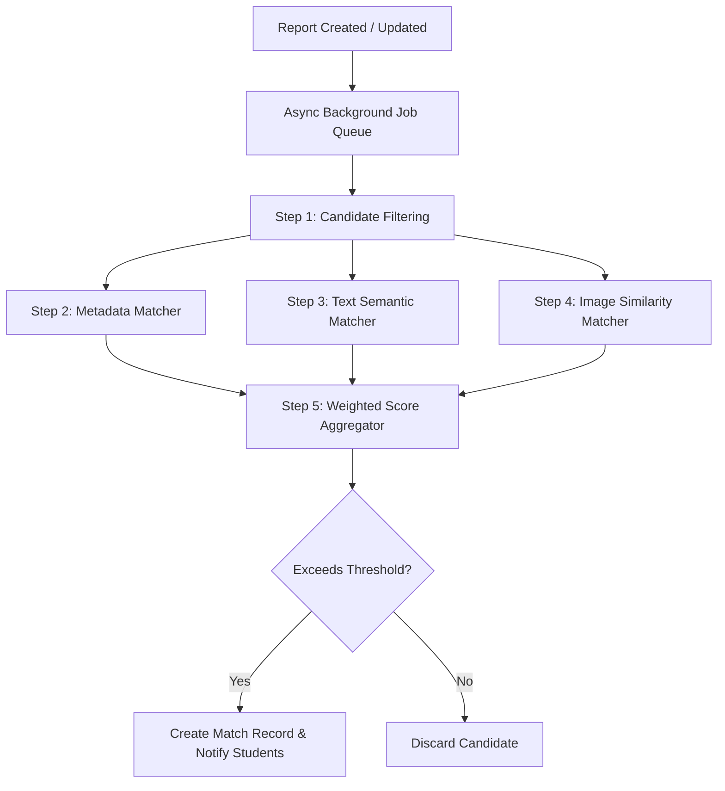

# CampusFind - Multimodal Matching Engine Spec

This document details the architectural layout, scoring metrics, mathematical formulas, and interface definitions for the CampusFind Matching Engine.

---

## 1. Matching Pipeline Architecture

The matching engine compares newly reported items against active items of the opposite type (e.g., when a lost item is created, it scans all active found items, and vice versa).



- **Candidate Filtering**: Reduces search space by checking coarse filters (e.g., item status must be `ACTIVE` and reported dates must be within a maximum range, such as 30 days).
- **Graceful Degradation**: If either report lacks usable images, the pipeline skips the image matcher and recalibrates the final formula weights automatically.

---

## 2. Mathematical Scoring Model

The final score is a weighted sum of three independent signals, constrained between `0.0` and `1.0`.

### 2.1 Weight Allocations

#### Case A: Both reports contain images
$$\text{CombinedScore} = (W_{meta} \times S_{meta}) + (W_{text} \times S_{text}) + (W_{img} \times S_{img})$$
* **Recommended Weights**:
  - $W_{meta} = 0.30$ (Category, Location, Date)
  - $W_{text} = 0.40$ (Name, description similarity)
  - $W_{img} = 0.30$ (Visual comparison)

#### Case B: Missing/Unusable images
$$\text{CombinedScore} = (W'_{meta} \times S_{meta}) + (W'_{text} \times S_{text})$$
* **Recommended Weights**:
  - $W'_{meta} = 0.40$
  - $W'_{text} = 0.60$

---

### 2.2 Signal Details

#### 2.2.1 Metadata Score ($S_{meta}$)
Composed of Category, Location, and Date similarity:
$$S_{meta} = (0.40 \times S_{cat}) + (0.30 \times S_{loc}) + (0.30 \times S_{date})$$

1. **Category Score ($S_{cat}$)**:
   - Binary: $1.0$ if the category matches exactly, otherwise $0.0$.
2. **Location Score ($S_{loc}$)**:
   - Same location zone: $1.0$.
   - Adjacent/overlapping zones (e.g., Cafeteria and Cafeteria Patio): $0.6$.
   - Completely different zones: $0.0$.
3. **Date Decay Score ($S_{date}$)**:
   - Evaluated using an exponential decay function based on the difference in days ($d$):
     $$S_{date} = e^{-\lambda d}$$
   - Where $\lambda = 0.2$ (yielding a score of $\approx 0.67$ at 2 days apart, and decaying to $\approx 0.13$ at 10 days apart).

#### 2.2.2 Text / Semantic Score ($S_{text}$)
Compares the textual title and description.
- **Phase 1 Implementation**: Fuzzy token set ratio (Levenshtein distance) and Jaccard similarity.
- **Phase 2 (AI Upgrade)**: Vector embeddings generated using a lightweight transformer model. The semantic score is the cosine similarity of the description vectors:
  $$S_{text} = \frac{A \cdot B}{\|A\| \|B\|}$$

#### 2.2.3 Image Similarity Score ($S_{img}$)
Compares the public/safe images of both items.
- **Phase 1 Implementation**: Stub module returning null or constant base match.
- **Phase 2 (AI Upgrade)**: Features extracted using a convolutional neural network (e.g., MobileNetV3 or ResNet50) or Gemini API image embeddings. Cosine similarity evaluates visual matching.

---

## 3. Match Explanations, Evidence, & Statuses

### 3.1 Match is NOT Ownership Approval
An AI Match is strictly a **similarity indicator** to help students locate their items. Under no circumstances does a match represent ownership verification or claim approval.
- **Match Status**: Managed independently of claim status:
  - `SUGGESTED`: Recommended to the student as a potential candidate.
  - `DISMISSED`: Rejected by the student as a false positive.
  - `EXPIRED`: One of the underlying reports has been resolved or archived.

### 3.2 Match Explainability & Evidence
To provide clarity, the Match entity preserves metadata explaining why it was recommended:
- **Scores**: Individual metrics (`metadataScore`, `textScore`, `imageScore`) are exposed in the UI as confidence scores.
- **Method**: The combined signal channel (`matchMethod`: `METADATA`, `TEXT`, `IMAGE`, or `MULTIMODAL`).
- **Reasons**: Human-readable, non-sensitive matching assertions (`matchReasons`), for example:
  - `"Same category"`
  - `"Similar description details"`
  - `"Found near same location"`
  - `"Reported within same date window"`
  - `"Similar visual characteristics"`
- **Privacy constraint**: No private ownership details (such as serial numbers, engravings, or unique scratches) are ever used or exposed in `matchReasons`.

---

## 4. Modular Interfaces (TypeScript)

To ensure the matching engines can be upgraded over time without breaking the routing logic, the core matching engine is defined by clean interfaces.

```typescript
export interface MatchingItem {
  id: string;
  name: string;
  description: string;
  categoryId: string;
  locationId: string;
  date: Date;
  imageUrls: string[];
}

export interface MatchScoreResult {
  metadataScore: number;
  textScore: number;
  imageScore: number | null;
  combinedScore: number;
  matchMethod: 'METADATA' | 'TEXT' | 'IMAGE' | 'MULTIMODAL';
  matchReasons: string[];
}

export interface ITextSimilarityMatcher {
  calculateSimilarity(textA: string, textB: string): Promise<number>;
}

export interface IImageSimilarityMatcher {
  calculateSimilarity(imgUrlA: string, imgUrlB: string): Promise<number>;
}

export interface IMatchingEngine {
  findMatches(item: MatchingItem): Promise<Array<{ targetId: string; scores: MatchScoreResult }>>;
}
```

---

## 5. Decisions Required (DECISION REQUIRED)

> [!WARNING]
> ### 1. Embedding Computations (Local CPU vs. Cloud API)
> **Context**: How do we generate text/image vectors for semantic matching?
> - **Option A**: Run vector extraction locally in Node.js using ONNX Runtime or `@xenova/transformers`. (Increases memory usage and CPU load on the server, but runs completely free).
> - **Option B**: Use cloud embedding APIs (e.g., Google Gemini embeddings API or OpenAI embeddings). (Simplifies server code and runs extremely fast, but introduces latency and external API usage costs).
> - **Recommendation**: Option A for text (highly cost-effective for medium workloads, can be run locally via light JS packages) and Option B/C for images. During development, mock matching scoring functions are used to keep infrastructure requirements minimal.
