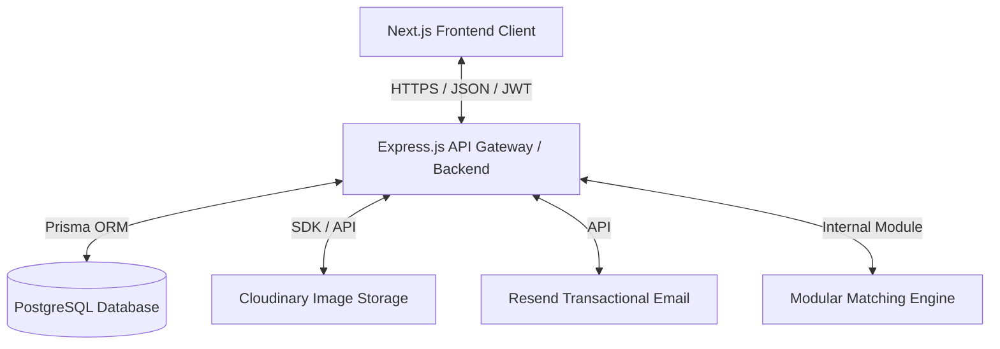
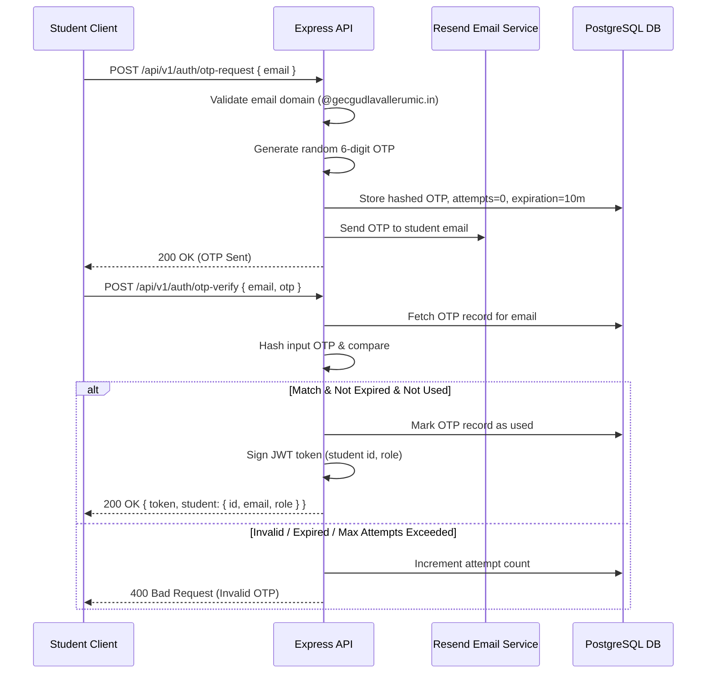

# CampusFind - Architectural Design Document

This document outlines the system architecture, component design, and project structure for CampusFind. It details how the frontend and backend applications interact and maintain separation of concerns.

---

## 1. System Overview

CampusFind is structured as a decoupled client-server architecture:



- **Frontend Client**: A responsive single-page web application built with **Next.js**, **TypeScript**, and styled with **Tailwind CSS**. It communicates with the backend exclusively via RESTful APIs.
- **Backend API Server**: An **Express.js** server running on **Node.js** written in **TypeScript**. It is responsible for business logic, database transactions, authorization, matching notifications, and communication with third-party APIs.
- **Database**: A relational **PostgreSQL** database accessed via **Prisma ORM**.
- **Third-Party Services**:
  - **Cloudinary**: Object storage for secure uploading and delivery of lost and found item images.
  - **SMTP/Nodemailer**: Transactional email delivery for OTP messages. Development mode logs locally only; production delivery requires configured SMTP credentials.

---

## 2. Directory Structure

To ensure a clean separation of concerns, the workspace will contain the frontend client and the backend server as distinct projects/directories.

```
/campusfind-workspace
├── docs/                      # Documentation files (System Specifications)
├── backend/                   # Node.js + Express + Prisma Server
│   ├── prisma/                # Prisma schema and migration history
│   │   └── schema.prisma
│   ├── src/
│   │   ├── config/            # App configuration (environment variables)
│   │   ├── controllers/       # HTTP Request handlers
│   │   ├── middleware/        # Authentication, authorization, rate-limiting, error handler
│   │   ├── routes/            # Express route declarations
│   │   ├── services/          # Business logic, database interactions, matching engine
│   │   │   ├── auth.service.ts
│   │   │   ├── item.service.ts
│   │   │   ├── claim.service.ts
│   │   │   └── matching/      # Modular matching service modules
│   │   │       ├── engine.ts
│   │   │       ├── text.ts
│   │   │       └── image.ts
│   │   ├── utils/             # Helper classes, logger, validation schemas
│   │   └── index.ts           # Server entry point
│   ├── package.json
│   ├── tsconfig.json
│   └── .env.example
│
└── frontend/                  # Next.js App Router Client
    ├── public/                # Static assets
    ├── src/
    │   ├── app/               # Page routing structure (App Router)
    │   │   ├── (auth)/        # Login / OTP verification pages
    │   │   ├── (dashboard)/   # Lost/Found reporting, claim tracking, student profile
    │   │   ├── admin/         # Moderator queues, user management, audit logs
    │   │   └── layout.tsx     # Global layout
    │   ├── components/        # Reusable UI components (buttons, modals, forms)
    │   │   ├── ui/            # Primitive design components (shadcn-inspired)
    │   │   └── shared/        # App-specific shared components (e.g. ItemCard)
    │   ├── hooks/             # Custom React hooks (auth, claims)
    │   ├── services/          # API client wrappers (axios/fetch)
    │   ├── store/             # Global client state management (Zustand)
    │   └── utils/             # Front-end helper utilities
    ├── package.json
    ├── tsconfig.json
    ├── tailwind.config.js
    └── .env.example
```

---

## 3. Communication Flows

### 3.1 Authentication Flow
Passwordless authentication is driven by backend verification tokens. No passwords are created or stored.



---

## 4. Architectural Principles

### 4.1 Separation of Concerns (SoC)
- **Zero Business Logic in UI**: React components in Next.js should only render state and capture user inputs. All logic (matching evaluation, claim rules, authorization checks) must reside in the backend services.
- **Service Layer Pattern**: Controllers in Express must only parse requests, invoke service functions, and return HTTP responses. The business logic must be isolated in service modules (e.g., `item.service.ts`), which in turn query database tables.

### 4.2 Centralized Error Handling
- The backend uses a global Express error-handling middleware.
- A custom `AppError` class extending `Error` captures:
  - `statusCode`: HTTP Status code (e.g., 400, 403, 404, 500)
  - `isOperational`: Boolean flag indicating if the error is known/expected (validation error, resource not found) or an unhandled system crash.
- Operational errors are cleanly reported to the client in a standard JSON format:
  ```json
  {
    "status": "error",
    "message": "Error details here"
  }
  ```
- Non-operational errors are logged to the console/logger with stack traces, masking internal database and server details from the client.

### 4.3 Database Migrations & Prisma ORM
- Schema updates must be executed using Prisma migrations (`prisma migrate dev`).
- The database schema strictly enforces foreign keys, unique constraints, and cascade delete policies.
- Database access is fully type-safe.

---

## 5. Architectural Decisions (DECISION REQUIRED)

> [!WARNING]
> ### 1. Session Management: JWT vs. Database Sessions
> **Context**: How do we handle authenticated student sessions?
> - **Option A**: Stateless JWT stored in a secure HttpOnly cookie. Simplifies vertical scaling but makes instant session revocation (e.g., if an admin bans a student) more complex.
> - **Option B**: Database-backed sessions. Easy to revoke, but adds db query overhead for every API request (mitigated by redis cache).
> - **Recommendation**: Option A. Short-lived JWTs (e.g., 1 hour expiry) with a refresh token rotation flow. When a student is banned, their refresh token is deleted from the DB, terminating the session once the current JWT expires.

> [!WARNING]
> ### 2. Monolithic vs. Serverless Matching Execution
> **Context**: Should matching run inside the main Express application or on a separate service?
> - **Option A**: Run inside the Express application thread. (Simplifies deployment, but AI models/embeddings compute can block the main process if load is high).
> - **Option B**: Offload matching to an asynchronous queue (e.g., BullMQ with Redis) processed by background workers.
> - **Option C**: Offload matching scoring calculations to a separate lightweight Python fastAPI server.
> - **Recommendation**: Option B. Use a queue library like BullMQ in Node.js to trigger matching asynchronously when a report is created. This ensures API request-response cycles remain fast (< 100ms) without locking up Express.
