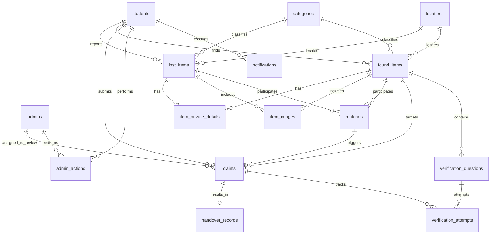

# CampusFind - Database Design Document

This document outlines the schema design, relationships, indexing strategies, and database configuration for PostgreSQL using Prisma ORM.

---

## 1. Schema Diagram & Relationships



---

## 2. Prisma Database Schema

Here is the revised Prisma schema for PostgreSQL:

```prisma
datasource db {
  provider = "postgresql"
  url      = env("DATABASE_URL")
}

generator client {
  provider = "prisma-client-js"
}

enum Role {
  STUDENT
  ADMIN
}

enum ItemStatus {
  ACTIVE
  MATCHED
  RETURNED
  CANCELLED
  ARCHIVED
}

enum ClaimStatus {
  PENDING_VERIFICATION
  PENDING_REVIEW
  APPROVED
  REJECTED
  ESCALATED
  CANCELLED
  ARCHIVED
}

enum MatchStatus {
  SUGGESTED
  DISMISSED
  EXPIRED
}

enum MatchMethod {
  METADATA
  TEXT
  IMAGE
  MULTIMODAL
}

enum QuestionType {
  STRUCTURED
  FREE_TEXT
}

enum NotificationType {
  OTP
  MATCH
  CLAIM
  VERIFICATION
  HANDOVER
  SYSTEM
}

model User {
  id                  String         @id @default(uuid())
  email               String         @unique
  role                Role           @default(STUDENT)
  isBanned            Boolean        @default(false)
  createdAt           DateTime       @default(now())
  updatedAt           DateTime       @updatedAt
  
  lostItems           LostItem[]
  foundItems          FoundItem[]
  
  // Distinct named relationships to avoid ambiguous relations in Prisma
  submittedClaims     Claim[]        @relation(name: "ClaimantRelation")
  assignedAdminClaims Claim[]        @relation(name: "AdminRelation")
  
  adminActions        AdminAction[]
  notifications       Notification[]

  @@index([email])
}

model OtpVerification {
  id             String   @id @default(uuid())
  email          String
  hashedOtp      String
  expiresAt      DateTime
  attempts       Int      @default(0)
  resendAttempts Int      @default(0)
  lastResentAt   DateTime @default(now())
  isUsed         Boolean  @default(false)
  createdAt      DateTime @default(now())

  @@index([email])
}

model Category {
  id          String   @id @default(uuid())
  name        String   @unique
  isSensitive Boolean  @default(false) // Sensitive categories may be configured for admin review
  createdAt   DateTime @default(now())
  updatedAt   DateTime @updatedAt

  lostItems   LostItem[]
  foundItems  FoundItem[]
}

model Location {
  id          String   @id @default(uuid())
  name        String   @unique
  description String?
  createdAt   DateTime @default(now())

  lostItems   LostItem[]
  foundItems  FoundItem[]
}

model LostItem {
  id               String       @id @default(uuid())
  userId           String
  categoryId       String
  locationId       String
  name             String
  description      String
  lostDate         DateTime
  lostTimeApprox   String?
  status           ItemStatus   @default(ACTIVE)
  createdAt        DateTime     @default(now())
  updatedAt        DateTime     @updatedAt

  user             User               @relation(fields: [userId], references: [id], onDelete: Cascade)
  category         Category           @relation(fields: [categoryId], references: [id])
  location         Location           @relation(fields: [locationId], references: [id])
  privateDetails   ItemPrivateDetails?
  images           ItemImage[]
  matches          Match[]

  @@index([userId])
  @@index([categoryId, status])
  @@index([locationId])
}

model FoundItem {
  id               String       @id @default(uuid())
  finderId         String
  categoryId       String
  locationId       String
  name             String
  description      String
  foundDate        DateTime
  foundTimeApprox  String?
  status           ItemStatus   @default(ACTIVE)
  createdAt        DateTime     @default(now())
  updatedAt        DateTime     @updatedAt

  finder           User                 @relation(fields: [finderId], references: [id], onDelete: Cascade)
  category         Category             @relation(fields: [categoryId], references: [id])
  location         Location             @relation(fields: [locationId], references: [id])
  privateDetails   ItemPrivateDetails?
  images           ItemImage[]
  matches          Match[]
  claims           Claim[]
  questions        VerificationQuestion[]

  @@index([finderId])
  @@index([categoryId, status])
  @@index([locationId])
}

model ItemImage {
  id          String   @id @default(uuid())
  imageUrl    String
  isSafe      Boolean  @default(true) // Publicly visible vs. private verification images
  lostItemId  String?
  foundItemId String?
  createdAt   DateTime @default(now())

  lostItem    LostItem?  @relation(fields: [lostItemId], references: [id], onDelete: Cascade)
  foundItem   FoundItem? @relation(fields: [foundItemId], references: [id], onDelete: Cascade)

  // NOTE: Database/application logic enforces that exactly one of lostItemId or foundItemId is non-null.
  // SQL DDL representation: 
  // CHECK ((lostItemId IS NOT NULL AND foundItemId IS NULL) OR (lostItemId IS NULL AND foundItemId IS NOT NULL))

  @@index([lostItemId])
  @@index([foundItemId])
}

model ItemPrivateDetails {
  id          String   @id @default(uuid())
  lostItemId  String?  @unique
  foundItemId String?  @unique
  uniqueMarks String?  // Specific identifying markers (scratches, marks, unique cases)
  engravings  String?  // Text engraved on item
  notes       String?  // Hidden details or serial numbers
  createdAt   DateTime @default(now())
  updatedAt   DateTime @updatedAt

  lostItem    LostItem?  @relation(fields: [lostItemId], references: [id], onDelete: Cascade)
  foundItem   FoundItem? @relation(fields: [foundItemId], references: [id], onDelete: Cascade)
}

model Match {
  id            String      @id @default(uuid())
  lostItemId    String
  foundItemId   String
  metadataScore Float       // 0.0 to 1.0 (similarity indicator, not proof of ownership)
  textScore     Float       // 0.0 to 1.0 (similarity indicator, not proof of ownership)
  imageScore    Float?      // 0.0 to 1.0 (similarity indicator, not proof of ownership)
  combinedScore Float       // 0.0 to 1.0 (similarity indicator, not proof of ownership)
  matchMethod   MatchMethod
  matchReasons  String      // Serialized non-sensitive match evidence (e.g. '["Same category", "Similar location"]')
  status        MatchStatus @default(SUGGESTED)
  createdAt     DateTime    @default(now())
  updatedAt     DateTime    @updatedAt

  lostItem      LostItem    @relation(fields: [lostItemId], references: [id], onDelete: Cascade)
  foundItem     FoundItem   @relation(fields: [foundItemId], references: [id], onDelete: Cascade)
  claims        Claim[]

  @@unique([lostItemId, foundItemId])
  @@index([combinedScore])
}

model Claim {
  id          String      @id @default(uuid())
  foundItemId String
  claimantId  String
  matchId     String?
  status      ClaimStatus @default(PENDING_VERIFICATION)
  adminId     String?     // Assigned admin to review claim when policy requires or escalated
  createdAt   DateTime    @default(now())
  updatedAt   DateTime    @updatedAt

  foundItem   FoundItem   @relation(fields: [foundItemId], references: [id], onDelete: Cascade)
  match       Match?      @relation(fields: [matchId], references: [id])
  attempts    VerificationAttempt[]
  handover    HandoverRecord?

  // Explicit relations mapped to the User model using unique names
  claimant      User      @relation(name: "ClaimantRelation", fields: [claimantId], references: [id], onDelete: Cascade)
  assignedAdmin User?     @relation(name: "AdminRelation", fields: [adminId], references: [id])

  @@index([foundItemId])
  @@index([claimantId])
  @@index([status])
}

model VerificationQuestion {
  id           String       @id @default(uuid())
  foundItemId  String
  questionText String
  type         QuestionType @default(FREE_TEXT)
  options      String?      // Serialized JSON array of choices for STRUCTURED type (e.g., '["Gold","Silver","Black"]')
  answerHash   String       // Configurable secure expected answer reference (exact hashing/comparison is DECISION REQUIRED)
  createdAt    DateTime     @default(now())

  foundItem    FoundItem             @relation(fields: [foundItemId], references: [id], onDelete: Cascade)
  attempts     VerificationAttempt[]

  @@index([foundItemId])
}

model VerificationAttempt {
  id          String   @id @default(uuid())
  claimId     String
  questionId  String
  isCorrect   Boolean  // Verification result only
  createdAt   DateTime @default(now())

  // NOTE: For privacy preservation, the raw answer input is evaluated in-memory and discarded.
  // It is NOT stored permanently in this table.

  claim       Claim                @relation(fields: [claimId], references: [id], onDelete: Cascade)
  question    VerificationQuestion @relation(fields: [questionId], references: [id], onDelete: Cascade)

  @@index([claimId])
}

model HandoverRecord {
  id                String    @id @default(uuid())
  claimId           String    @unique
  finderConfirmed   Boolean   @default(false)
  claimantConfirmed Boolean   @default(false)
  handoverDate      DateTime?
  createdAt         DateTime  @default(now())
  updatedAt         DateTime  @updatedAt

  claim             Claim     @relation(fields: [claimId], references: [id], onDelete: Cascade)
}

model Notification {
  id        String           @id @default(uuid())
  userId    String
  title     String
  message   String
  type      NotificationType
  isRead    Boolean          @default(false)
  createdAt DateTime         @default(now())

  user      User             @relation(fields: [userId], references: [id], onDelete: Cascade)

  @@index([userId, isRead])
}

model AdminAction {
  id         String   @id @default(uuid())
  adminId    String
  actionType String   // e.g. "RESOLVE_CLAIM", "DELETE_REPORT", "BAN_USER"
  targetId   String   // UUID of modified target
  details    String   // Description of change and reasoning
  createdAt  DateTime @default(now())

  admin      User     @relation(fields: [adminId], references: [id], onDelete: Cascade)

  @@index([adminId])
}
```

---

## 3. Database Design Decisions & Justification

### 3.1 Partitioning PUBLIC/SAFE vs. PRIVATE/PROTECTED Fields
- **Safe Fields**: General names, categories, general description, date, location, and images marked `isSafe: true` are stored directly in `LostItem`, `FoundItem`, and `ItemImage` models, returned freely in list feeds.
- **Private Fields**: Unique identifiers, engravings, marks, verification answers, and images marked `isSafe: false` are separated into the `ItemPrivateDetails` table. This isolates sensitive content from casual API selection queries.

### 3.2 Verification Answer Privacy Design
- **VerificationQuestion**: Contains the question metadata and a secure reference of the expected answer (`answerHash`).
- **VerificationAttempt**: Stores only the evaluation outcome `isCorrect`. The student's raw answer input is checked in-memory and immediately discarded, leaving no persistent plaintext trace in database storage.

### 3.3 Data Retention & Historical Integrity
- To prevent loss of history for audit trails and system metrics (e.g. analytics, matching, handover logs), we avoid hard deleting key entities.
- **LostItem / FoundItem / Claim**: Utilize the `ARCHIVED` status. When items are returned, claims completed, or items cancelled, their status transitions to `RETURNED`, `CANCELLED`, or `ARCHIVED`.
- **Match Engine Logs**: Matching history maintains `DISMISSED` or `EXPIRED` status logs to ensure system tuning capabilities.
- **AdminAction**: Permanent, immutable audit trails, keeping records of admin actions securely linked.

### 3.4 Image Invariant Validation
- Every `ItemImage` record must relate to exactly one source item report. This is represented by requiring one (and only one) of `lostItemId` or `foundItemId` to be set. Database migrations will implement check constraints to maintain this integrity.

---

## 4. Decisions Required (DECISION REQUIRED)

> [!WARNING]
> ### 1. Final Verification Answer Secure Storage
> **Context**: How should expected verification answers be securely verified and stored?
> - **Open Decision**: The final secure storage/comparison mechanism for expected answers will be selected during implementation after the exact verification logic is finalized. Raw claimant answers must not be unnecessarily exposed or retained.

> [!WARNING]
> ### 2. Data Retention Durations
> **Context**: How long should archived claim, matches, and inactive report data be kept?
> - **Open Decision**: Retention periods are a DECISION REQUIRED item to finalize before production deployment.
