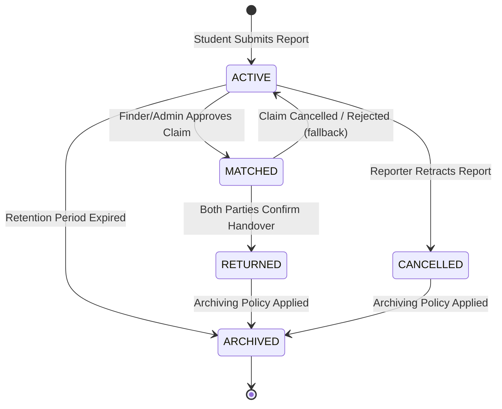
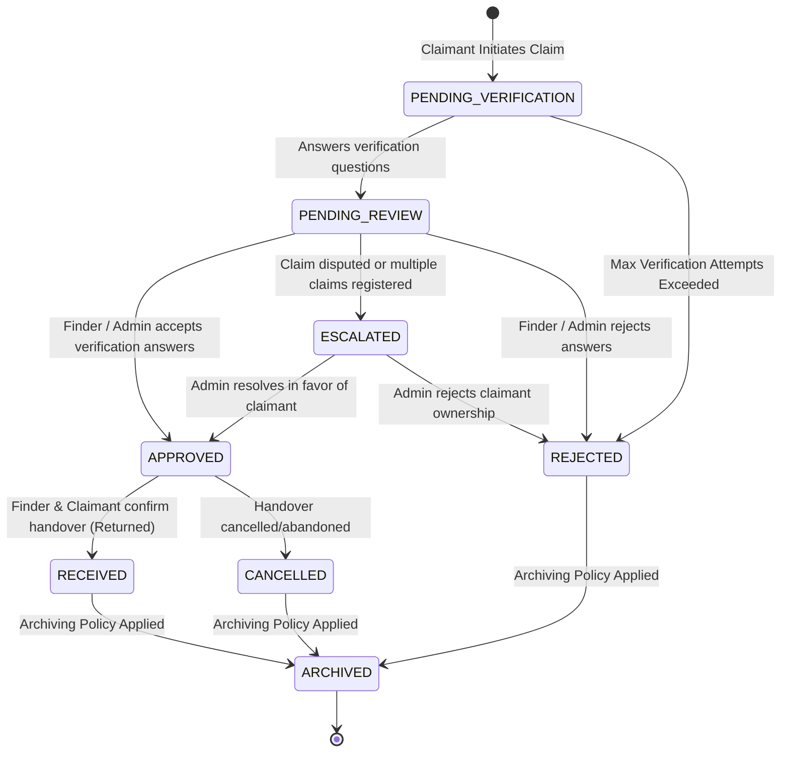

# CampusFind - User Flows & State Transitions

This document maps out the critical student journeys, interactions, and state transitions of items and claims in CampusFind.

---

## 1. State Machine Designs

### 1.1 Item Report Lifecycle
Both **Lost Items** and **Found Items** transition through various states.

- **ACTIVE**: The item is visible in search feeds and recommendation calculations.
- **MATCHED**: A claim on this item has been verified and approved. The item is temporarily locked.
- **RETURNED**: Finder and claimant have confirmed physical recovery.
- **CANCELLED**: The reporter retracted the report (e.g., resolved privately).
- **ARCHIVED**: The record is moved to an inactive state for historical metrics/analytics and is hidden from public API feeds.

### 1.2 Claim Lifecycle
A claim is created when a student identifies a found item as theirs.

---

## 2. Step-by-Step Journeys

### 2.1 Student Authentication (OTP Entry)
1. **Navigate**: Student opens the web application and enters their college email address.
2. **Input**: Student enters their college email (e.g., `student@gecgudlavallerumic.in`).
3. **Submit**: Student clicks "Request OTP".
4. **Validation (Client & Server)**:
   - System checks email formatting.
   - System verifies the domain is configured in the permitted list.
5. **OTP Sent**: If valid, the system generates a 6-digit OTP, stores its hash, starts rate limit calculations, and sends the OTP to the email.
6. **Input Code**: Student inputs the received code.
7. **Complete**: System validates the code:
   - If valid, a session is created and the student is redirected to the Dashboard.
   - If invalid, attempt counters increment. Max attempts (e.g., 5) delete the OTP session, requiring a new request.

---

### 2.2 Reporting a Lost/Found Item
1. **Initiation**: Student clicks "Report Lost Item" or "Report Found Item" on the dashboard.
2. **Form Entry**:
   - **Step 1: General Info**: Title, category, approximate date, approximate time, and campus location.
   - **Step 2: Description & Public Image**: General description (e.g., "Black wallet") and a safe public image.
   - **Step 3: Private Details**: Unique markings (e.g., "sticker of a green dinosaur").
   - **Step 4: Verification Setup** (*Found Reports Only*): Finder sets questions:
     - **STRUCTURED**: Options defined (e.g., "What color is the logo? Options: Red / Blue / Green").
     - **FREE_TEXT**: Text input required (e.g., "What name is written on the inner tag?").
3. **Submit**: Report is stored. Item images are validated to enforce the invariant (belonging to exactly one lost or found report). A background job triggers matching recommendations.

---

### 2.3 System Matching & Notifications
1. **Evaluation**: Upon report submission, matching runs asynchronously.
2. **Calculation**: The engine calculates metadata, semantic description, and image similarity.
3. **Match Discovered**: If a match is found:
   - A `Match` record is created in status `SUGGESTED` (not approved).
   - In-app notification and email are dispatched to the lost item reporter containing non-sensitive match reasons (e.g., "Similar location and category"). No private information is exposed.
4. **Student Review**: Student clicks the notification to view safe public info of the matching item.

---

### 2.4 Claim & Verification Flow
1. **Initiate Claim**: Student clicks "Claim" on a found item card.
2. **Answering Questions**:
   - Student is shown the questions.
   - For **STRUCTURED** questions, they select an option.
   - For **FREE_TEXT** questions, they input their text.
3. **Validation**:
   - The student submits answers.
   - Verification attempts check limits. Raw answers are evaluated in-memory and discarded. Only `isCorrect` status is logged.
   - The claim transitions to `PENDING_REVIEW`.
4. **Review Routing**:
   - **Normal Items**: The finder is notified to review claim answers.
   - **Sensitive/High-Value Items**: If the category is configured for admin review, the claim escalates to the Admin Queue. The finder is not notified.
5. **Decision**:
   - Finder or Admin reviews verification attempts and clicks "Approve" or "Reject".
   - Approval updates the claim to `APPROVED` and the item to `MATCHED`. Other pending claims on that item are marked `REJECTED`.

---

### 2.5 Coordinate Handover & Complete Recovery
1. **Coordination**: System displays coordinates or direct contacts (e.g., "Meet at Library Desk").
2. **Physical Meetup**: Finder and claimant meet.
3. **Verification**: Finder exchanges the item, or an Admin checks IDs for high-value assets.
4. **Finder Confirmation**: Finder clicks "Confirm Handover" in the app.
5. **Claimant Confirmation**: Claimant clicks "Confirm Receipt" in the app.
6. **Closing**: Once both confirm, the item is marked `RETURNED` and queued for archiving.

---

## 3. Alternative & Error Paths (Handling Edge Cases)

### 3.1 Multiple Active Claims on One Item
- **Rule**: Multiple students can submit claims for a single found item.
- **Handling**:
  - Approving a claim updates other claims to `REJECTED`.
  - If a handover is cancelled (e.g., students realized it was a mistake during meetup), the finder cancels the approved claim, restoring the item status to `ACTIVE` and returning remaining claims to `PENDING_REVIEW` if applicable.

### 3.2 Spammed Claims
- **Rule**: Prevent users from mass-claiming items.
- **Handling**:
  - Claimant is rate-limited to 3 active claims at any time.
  - Banned student IDs are restricted from starting new claims.
